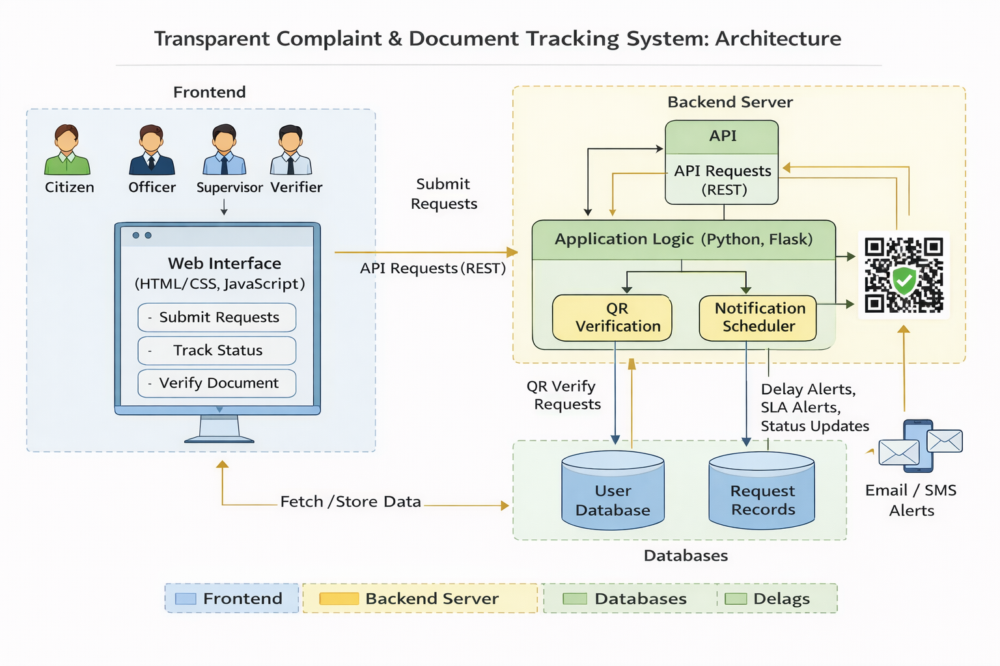

# Architecture Overview

The system follows a **modular, role-based, service-oriented architecture** designed for scalability and auditability.

---

## System Architecture Diagram

---
## Major Components

### Frontend Layer
- Citizen Dashboard
- Officer Dashboard
- Supervisor Dashboard
- Public QR Verification Page

### Backend Layer
- Authentication Service (OTP + JWT)
- Workflow Engine
- SLA & Escalation Engine
- Audit Logging Service
- QR & Digital Signature Service

### Storage Layer
- User Database
- Request Database
- Immutable Audit Logs
- Document Storage

---

## Security Design
- Role-Based Access Control (RBAC)
- Encrypted communication
- Append-only audit logs
- Tamper-proof QR verification
