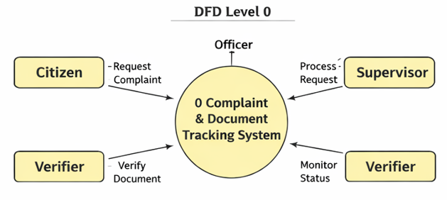
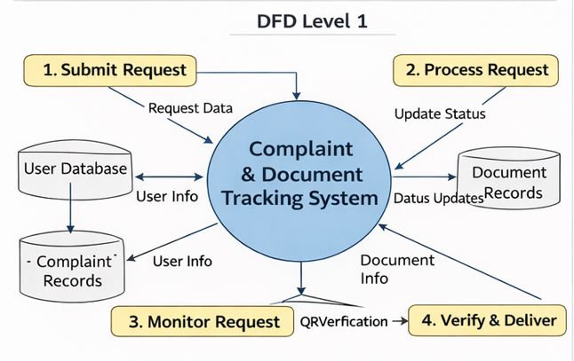
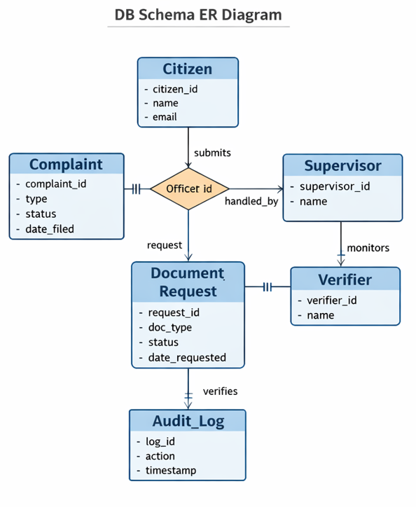

# Data Flow & System Architecture  
## Transparent Complaint & Document Tracking System

---

## 1. DFD Level 0 (Context Diagram)

### Overview
DFD Level 0 represents the entire system as a **single process** and shows how external entities interact with it.

### Diagram

### External Entities
- **Citizen** – Submits complaints or document requests  
- **Officer** – Processes requests  
- **Supervisor** – Monitors delays and escalations  
- **Verifier** – Verifies documents using QR  
- **System** – Handles automation, SLA tracking, and notifications  

### Data Flows
- Citizen → System: Request / Complaint  
- Officer → System: Status Updates  
- Supervisor → System: Monitoring / Escalation Actions  
- Verifier → System: Verification Result  
- System → Users: Status, Notifications, Verified Documents  

---

## 2. DFD Level 1 (Major Process Breakdown)

DFD Level 1 decomposes the system into its **core functional processes**.

### Diagram

### Processes

#### 1.0 Submit Request  
**Input:** Citizen details, request type, complaint/document info  
**Output:** Stored request record, acknowledgement  

#### 2.0 Process Request  
**Input:** Request data from database  
**Output:** Status updates, assignment to officer  

#### 3.0 Monitor & Escalate  
**Input:** Processing time, SLA limits  
**Output:** Delay alerts, escalation to supervisor  

#### 4.0 Verify & Deliver  
**Input:** Processed document, QR code  
**Output:** Verified document, delivery confirmation  

### Data Stores
- **User Database** – Citizen, Officer, Supervisor, Verifier data  
- **Request Records** – Complaints, document requests, status logs  

---

## 3. Database Design (ER Diagram)

### Diagram

### Core Tables
- **User** – Stores citizen and official information  
- **Request** – Tracks complaints and document requests  
- **Complaint** – Complaint-specific records  
- **Document** – Generated documents with QR codes  
- **Audit_Log** – Tracks every system action  

---

## 4. Frontend–Backend Architecture

### 4.1 Frontend Layer

**Technologies:** HTML, CSS, JavaScript  
**Users:** Citizen, Officer, Supervisor, Verifier  

**Functions:**
- Submit complaints / document requests  
- Track request status  
- View delay alerts and escalation  
- Verify documents using QR  

---

### 4.2 Backend Layer

**Technologies:** Python (Flask), REST API  

**Modules:**
- Request Management  
- SLA Timer & Escalation Engine  
- QR Verification Service  
- Notification Scheduler (Email/SMS)  

**Responsibilities:**
- Business logic execution  
- Role-based access control  
- Delay detection and alerts  
- QR generation and verification  

---

### 4.3 Database Layer

**Stores:**
- User data  
- Request lifecycle  
- Processing history  
- Verification and escalation logs  

---

## 5. Data Flow Summary

1. Citizen submits request via frontend  
2. Backend validates and stores data  
3. Officer processes and updates status  
4. SLA engine monitors for delays  
5. Supervisor receives escalations if overdue  
6. Verifier authenticates documents via QR  
7. Citizen receives verified output  

---

