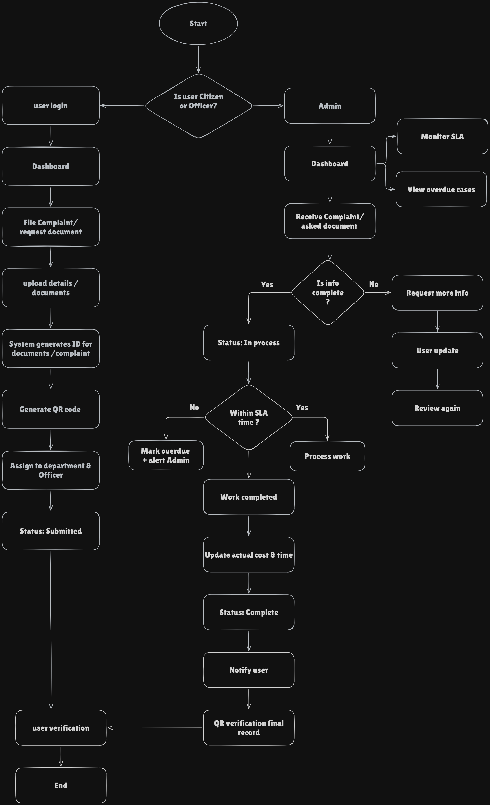

## System Flowchart Explanation

This flowchart represents the complete workflow of the Transparent Complaint & Document Tracking System.

## Objective
To design a system that ensures:
- Transparent processing
- Time and cost accountability
- Digital verification using QR codes

### User Flow
1. User logs in or registers.
2. Files a complaint or document request.
3. Uploads required details and documents.
4. System generates a unique ID and QR code.
5. Request is assigned to the relevant department and officer.
6. Status is marked as "Submitted".

### Officer Flow
1. Officer receives the assigned request.
2. Verifies if submitted information is complete.
3. If incomplete, requests additional information from the user.
4. If complete, request moves to "In Process".
5. System continuously checks SLA time limits.
6. If SLA is exceeded, the request is marked overdue and admin is alerted.
7. After completion, actual cost and time are updated.
8. Status is marked "Completed".

### Final Verification
- User is notified after completion.
- Final record is publicly verifiable using QR code.
- This ensures transparency, accountability, and trust.
